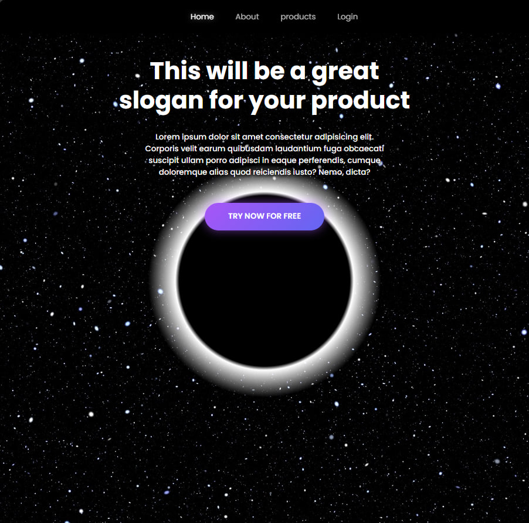
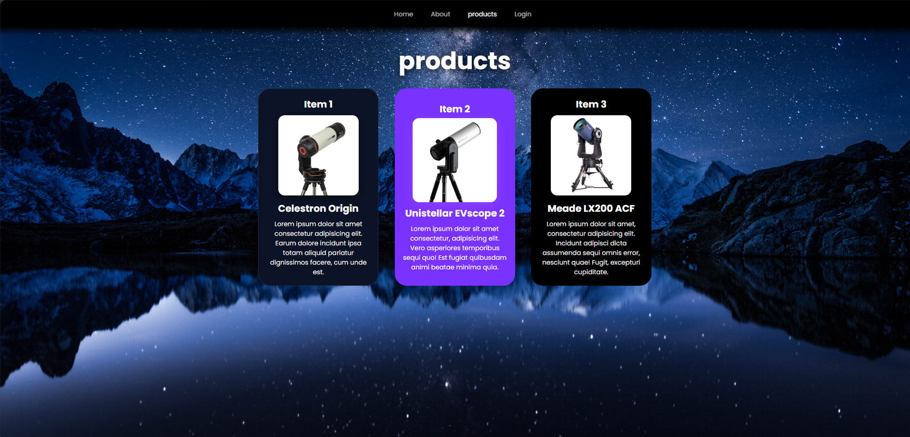
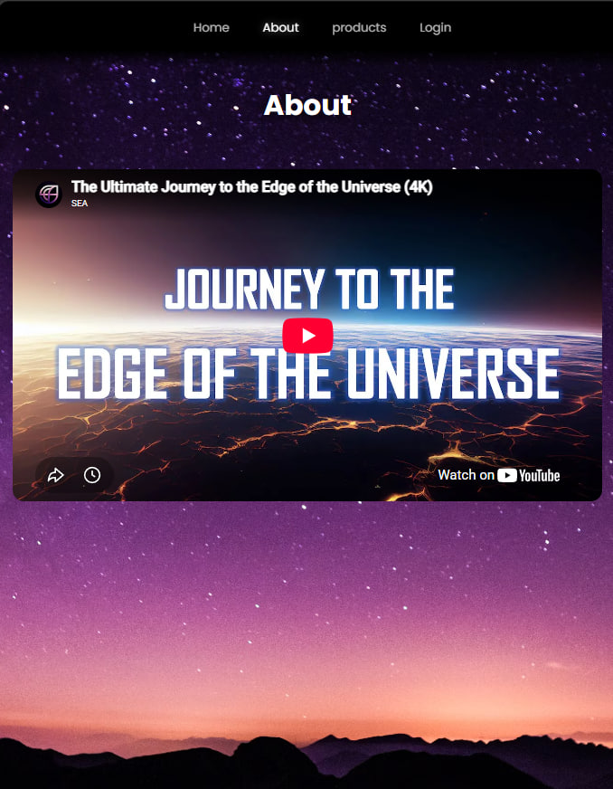
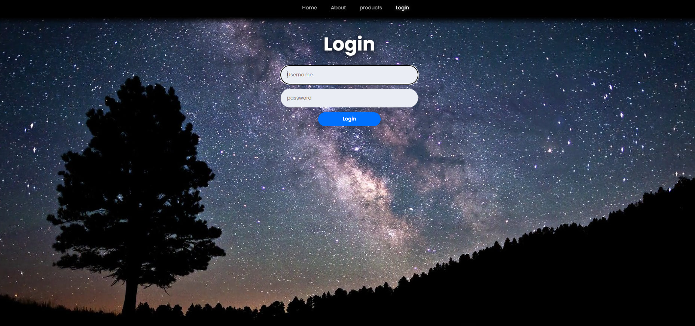

  

  

<h1 style="font-size: 48px; font-weight: 900; color: #0071FF; margin: 20px 0 5px 0; border: none;">🌌 Telescope shop 🔭</h1>

  

  

Welcome to my very first web development project! Built entirely from scratch using pure <b>HTML5</b> and <b>CSS3</b>, this project is a fully responsive e-commerce platform designed for astronomy enthusiasts and high-end telescope buyers.

 

  

 

<h2 style="color: #2C5F9B; font-size: 36px; font-weight: 900; margin-bottom: 20px; border: none;">🛠️ Built With</h2>

  
  
  

 

  

 

<h2 style="color: #2C5F9B; font-size: 36px; font-weight: 900; margin-bottom: 30px; border: none;">📸 Project Previews</h2>

<h3 style="color: #4A7FBF; font-size: 28px; font-weight: 800;">🏠 Home Page</h3>
 

  

<h3 style="color: #4A7FBF; font-size: 28px; font-weight: 800;">🛍️ Products Page</h3>
 

  

<h3 style="color: #4A7FBF; font-size: 28px; font-weight: 800;">🎬 About Page</h3>
 

  

<h3 style="color: #4A7FBF; font-size: 28px; font-weight: 800;">🔐 Login Page</h3>
 

 

 

  

 

<h2 style="color: #2C5F9B; font-size: 36px; font-weight: 900; margin-bottom: 25px; border: none;">✨ Key Highlights</h2>

  
✔️ <b>100% Custom Design & Layout:</b> Designed with full creative freedom, featuring a cosmic black hole visual effect, dark glassmorphism cards, and modern layout aesthetics.

  
✔️ <b>Fully Responsive:</b> Seamlessly adapts to all screen sizes—from mobile devices to ultra-wide monitors.

  
✔️ <b>Pure CSS Effects:</b> Built with modern CSS techniques including flexbox, clamp() typography, CSS gradients, and interactive hover animations.

 

  

 

<h2 style="color: #2C5F9B; font-size: 36px; font-weight: 900; margin-bottom: 25px; border: none;">📂 File Structure</h2>

<pre style="color: #c9d1d9; font-size: 17px; font-family: ui-monospace, SFMono-Regular, SF Mono, Menlo, Consolas, Liberation Mono, monospace; background: transparent; border: none; margin: 0; padding: 0; line-height: 1.6;">
📦 telescope-shop
 ┣ 📂 style/                  # CSS Stylesheets
 ┃ ┣ 📜 about.css             # Styles for the About page
 ┃ ┣ 📜 home.css              # Styles for the Home page
 ┃ ┣ 📜 log in.css            # Styles for the Login page
 ┃ ┗ 📜 shop.css              # Styles for the Shop/Products page
 ┣ 📜 about.html              # About section
 ┣ 📜 home.html               # Main landing page
 ┣ 📜 log in.html             # User authentication page
 ┣ 📜 shop.html               # Products and telescope listings
 ┣ 📜 solar-system.svg        # 3D Solar system animation for README
 ┣ 📜 footer.svg              # Footer animation for README
 ┗ 📜 README.md               # You are here!
</pre>

 

  

 

  Feel free to explore the repository and live demo! 🚀

  

